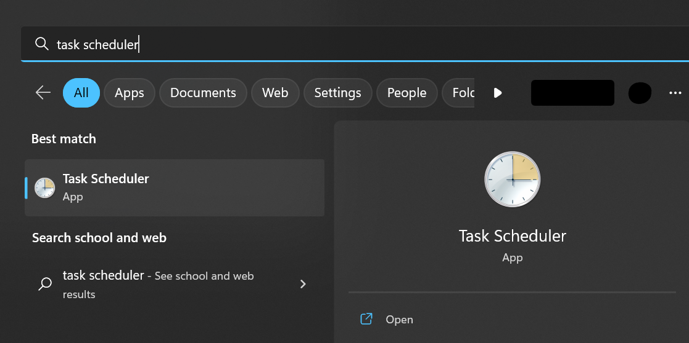
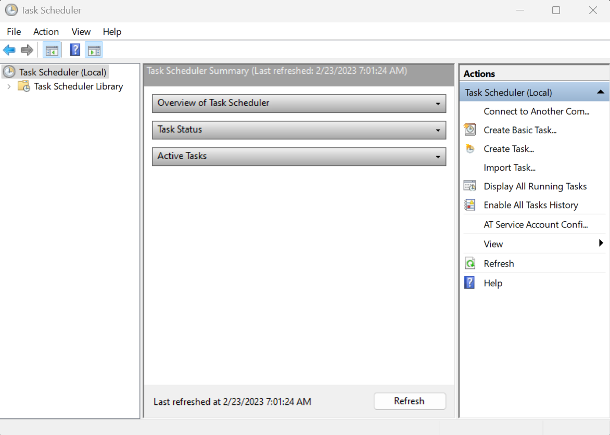
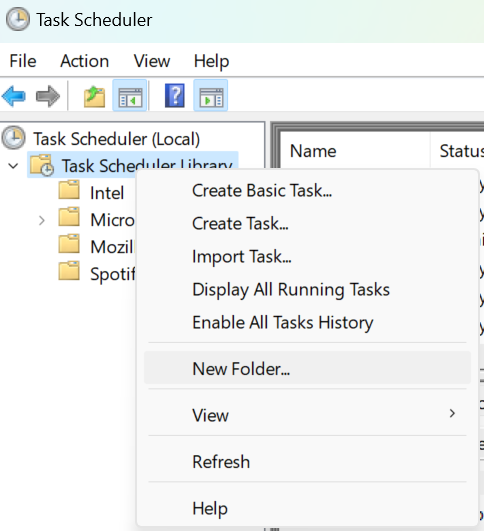
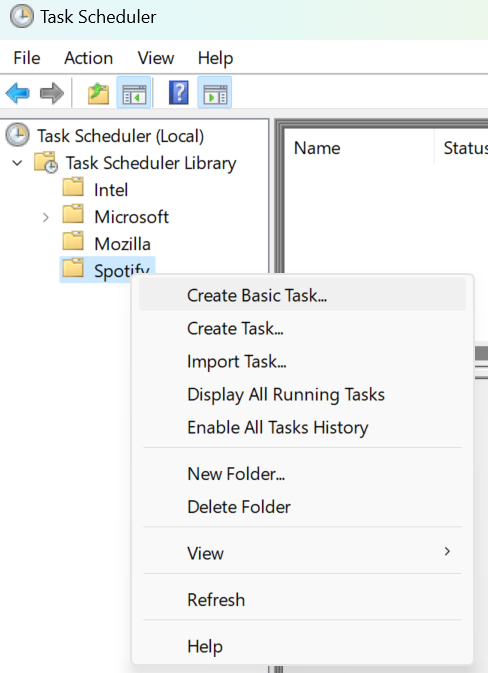
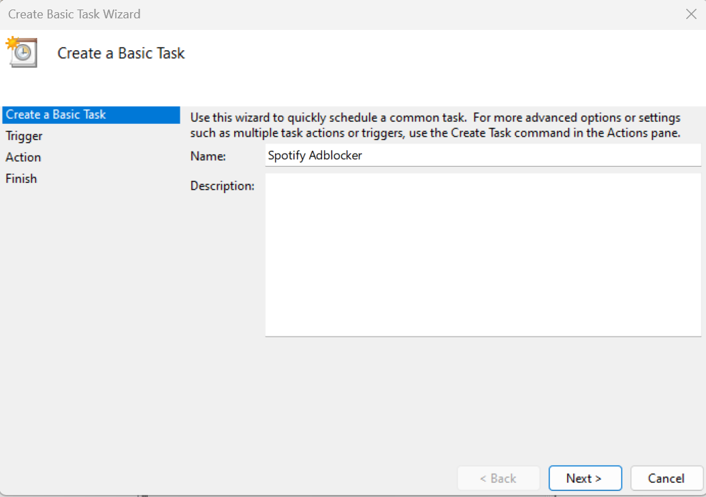
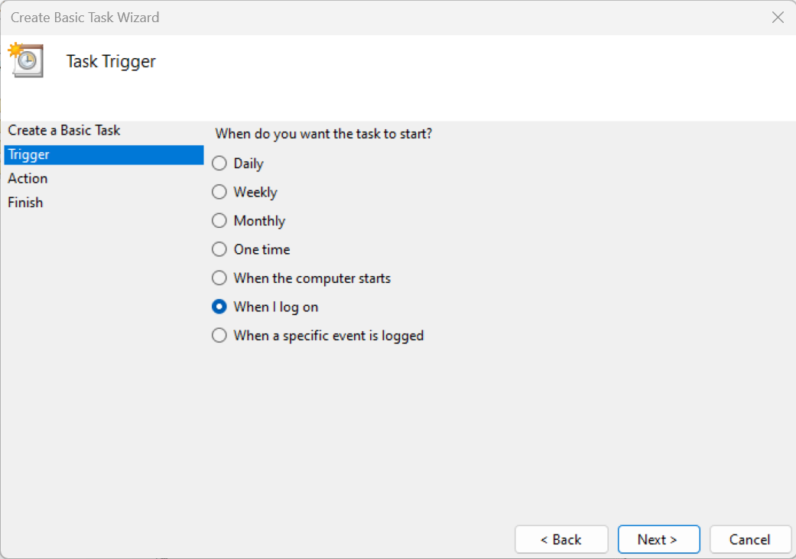
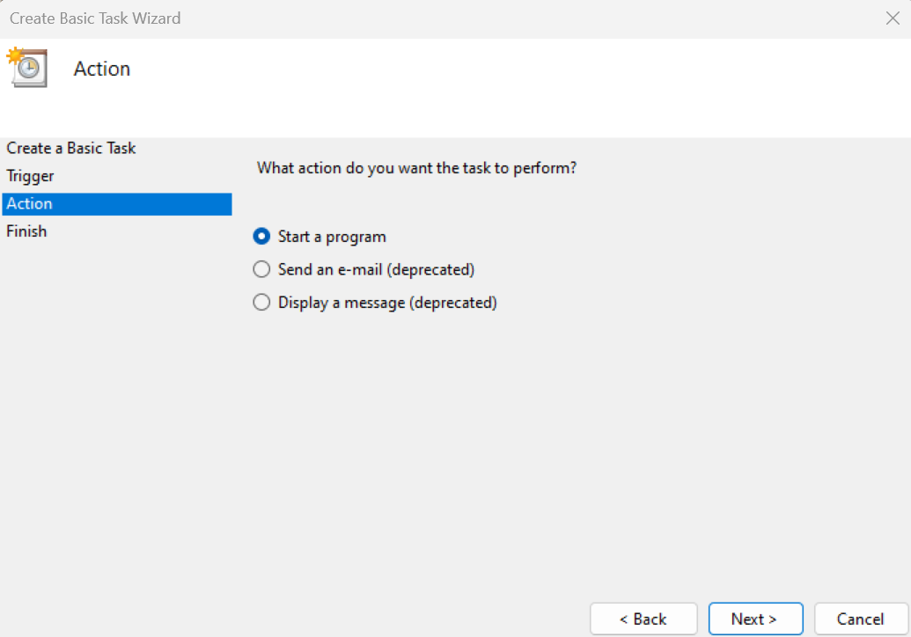
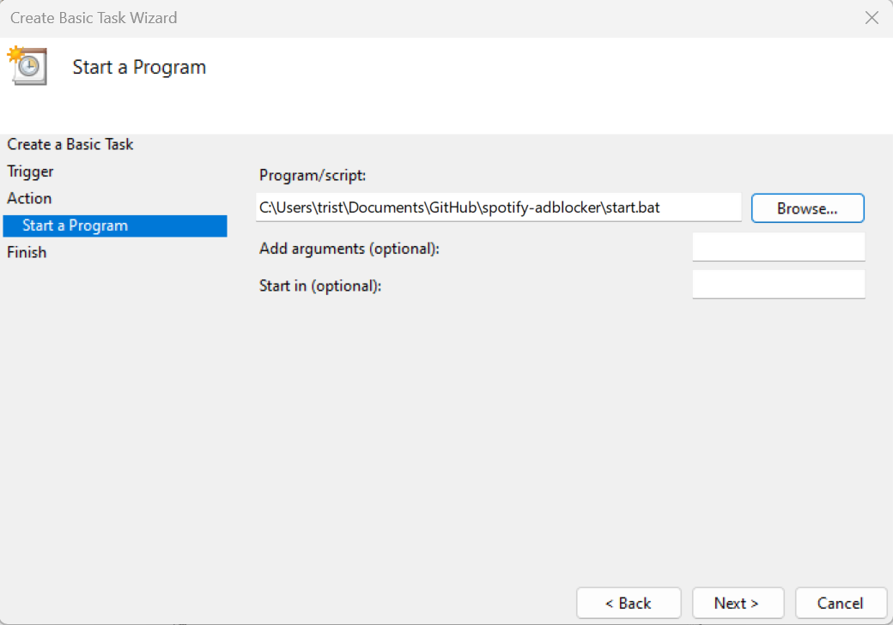

1. Open the `Task Scheduler` app.

2. Create a new folder, e.g. `Spotify`.

3. Double click on the folder name to open the folder.
4. Click `Create Basic Task`

5. Add a name and click on `Next`.

6. Set the trigger to `When I log on`.

7. Set the Action to `Start a program`.

8. Define the path to the `start.bat` file

9. Click the `Finish` button