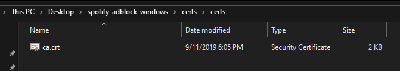
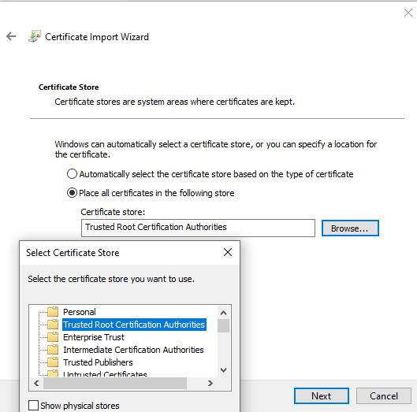
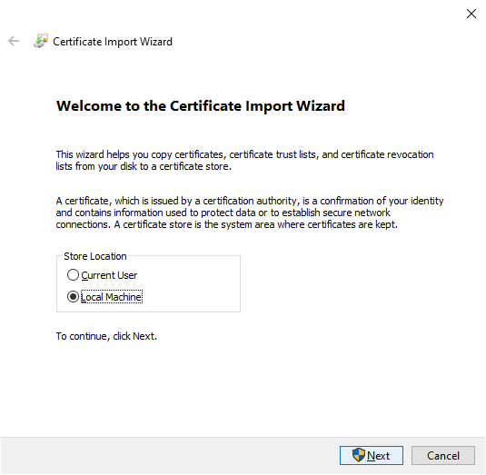

After you first run the application, a CA certificate will be stored at `certs/certs/ca.cert`

First, open the certificate by double clicking it and then press "Install certificate..." at the bottom

Then, select the "Local Machine" ("Current User" might work too but I haven't tested) and click "Next" (requires administration privileges)

On the next screen, select "Place all certificates in the following store", click "Browse.." and select "Trusted Root Certification Authorities"

Finally, click "Finish" and you're good to go.
